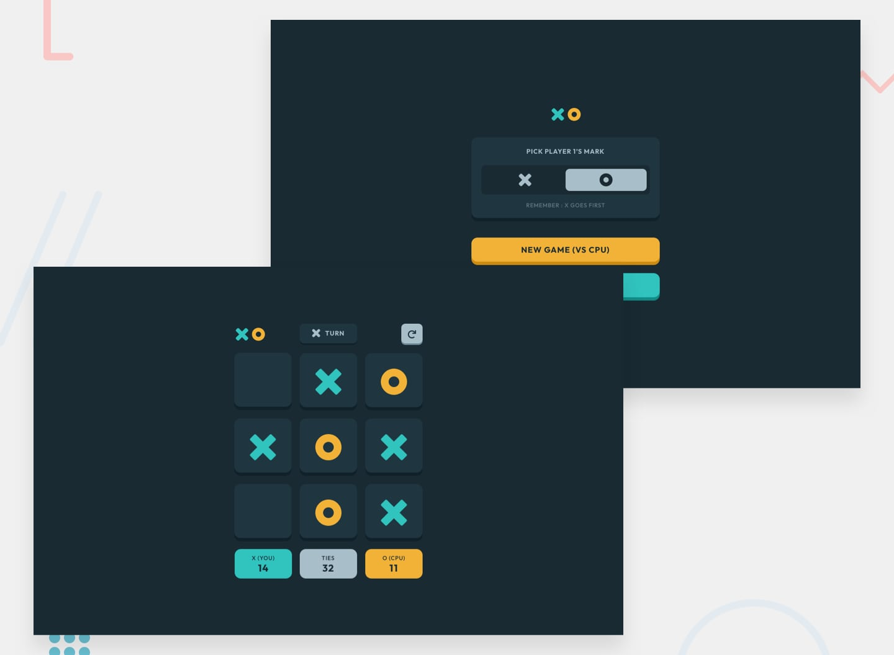

# Frontend Mentor - Tic Tac Toe Solution

This is a pixel-perfect, fully responsive solution to the [Tic Tac Toe challenge on Frontend Mentor](https://www.frontendmentor.io/challenges/tic-tac-toe-game-Re7ZF_E2v). Built with **React**, **TypeScript**, and **Tailwind CSS**, featuring an unbeatable computer opponent powered by the **Minimax algorithm**.

## Table of contents

- [Overview](#overview)
  - [The Challenge](#the-challenge)
  - [Screenshot & Preview](#screenshot--preview)
  - [Live Links](#live-links)
- [Features](#features)
- [Architecture & Tech Stack](#architecture--tech-stack)
  - [Built With](#built-with)
  - [State Machine & Architecture](#state-machine--architecture)
  - [Unbeatable CPU (Minimax Algorithm)](#unbeatable-cpu-minimax-algorithm)
- [Design Tokens (Figma Alignment)](#design-tokens-figma-alignment)
- [Getting Started](#getting-started)
- [Author](#author)

---

## Overview

### The Challenge

Users should be able to:

- View the optimal layout for the game depending on their device's screen size (Mobile & Desktop).
- See interactive hover states for all elements, including translucent outline marks hovering over empty cells.
- Play either **Solo vs CPU** or **Multiplayer (Pass & Play)**.
- **Bonus 1**: Game state preserved in browser `localStorage` across page reloads.
- **Bonus 2**: Smart CPU opponent that proactively defends and seeks victory rather than playing randomly.

### Screenshot & Preview



### Live Links

- **Live Site:** [https://fm-tic-tac-toe-gules.vercel.app](https://fm-tic-tac-toe-gules.vercel.app)
- **GitHub Repository:** [https://github.com/Eng-MohamedHosny/fm-tic-tac-toe](https://github.com/Eng-MohamedHosny/fm-tic-tac-toe)

---

## Features

- 🎮 **Two Game Modes:** Play against an intelligent computer or pass-and-play with a friend.
- 🤖 **Minimax AI Engine:** Computer evaluates all possible future moves recursively to guarantee optimal defensive and offensive play.
- 🎨 **Pixel-Perfect Figma Design:** Faithful reproduction of colors, typography (`Outfit`), and 3D keycap bevel shadows (`inset 0 -8px 0` / `inset 0 -4px 0`).
- 👁️ **Dynamic Hover States:** Empty tiles reveal the active player's mark outline on hover.
- 🏆 **Winning Line Highlighting:** The 3 connected winning tiles dynamically swap backgrounds and icon fills to celebrate the victory.
- 💾 **Persistent State:** Saves scores, active board, and player configurations to `localStorage`.
- 🔄 **Restart & Round-Over Modals:** Contextual announcements ("YOU WON!", "OH NO, YOU LOST…", "PLAYER 1 WINS!", "ROUND TIED") with action triggers.

---

## Architecture & Tech Stack

### Built With

- **[React 18](https://react.dev/)** - Component-driven declarative UI.
- **[TypeScript](https://www.typescriptlang.org/)** - Strict type-safety for game state, player marks, and board arrays.
- **[Tailwind CSS](https://tailwindcss.com/)** - Utility-first styling configured with custom design tokens.
- **[Vite](https://vitejs.dev/)** - Next-generation frontend build tooling.
- **[Vercel](https://vercel.com/)** - Continuous deployment and production hosting.

### State Machine & Architecture

The game logic is completely decoupled from UI rendering:
* `src/types/game.ts`: Strict types (`PlayerMark`, `Board`, `WinningLine`, `GameState`).
* `src/utils/gameLogic.ts`: Pure functions for checking winners, board capacity, and available moves.
* `src/utils/minimax.ts`: Recursive Minimax algorithm for decision evaluation.
* `src/hooks/useTicTacToe.ts`: Centralized `useReducer` managing pure state transitions and synchronizing with `localStorage`.

### Unbeatable CPU (Minimax Algorithm)

The AI engine uses the **Minimax decision rule**:
$$\text{Score} = \begin{cases} +10 - \text{depth} & \text{if CPU wins} \\ -10 + \text{depth} & \text{if Human wins} \\ 0 & \text{if Tie} \end{cases}$$

This ensures the CPU prioritizes earlier wins, delays potential defeats as long as possible, and never falls into basic fork traps.

---

## Design Tokens (Figma Alignment)

| Element | Color | Hex Code | 3D Inset Shadow |
| :--- | :--- | :--- | :--- |
| **Dark Navy (Background)** | `navy-dark` | `#1A2A33` | - |
| **Semi-Dark Navy (Surface)** | `navy-semi` | `#1F3641` | `inset 0 -8px 0 0 #10212A` |
| **Teal (Mark X / P1)** | `teal` | `#31C3BD` | `inset 0 -8px 0 0 #118C87` |
| **Yellow (Mark O / P2)** | `yellow` | `#F2B137` | `inset 0 -8px 0 0 #CC8B13` |
| **Silver (Neutrals)** | `silver` | `#A8BFC9` | `inset 0 -4px 0 0 #6B8997` |

---

## Getting Started

### Prerequisites

* Node.js (v18 or higher)
* npm or yarn

### Installation

1. Clone the repository:
   ```bash
   git clone https://github.com/Eng-MohamedHosny/fm-tic-tac-toe.git
   cd fm-tic-tac-toe
   ```

2. Install dependencies:
   ```bash
   npm install
   ```

3. Start development server:
   ```bash
   npm run dev
   ```

4. Build for production:
   ```bash
   npm run build
   ```

---

## Author

- GitHub - [@Eng-MohamedHosny](https://github.com/Eng-MohamedHosny)
- Frontend Mentor - [@Eng-MohamedHosny](https://www.frontendmentor.io/profile/Eng-MohamedHosny)
